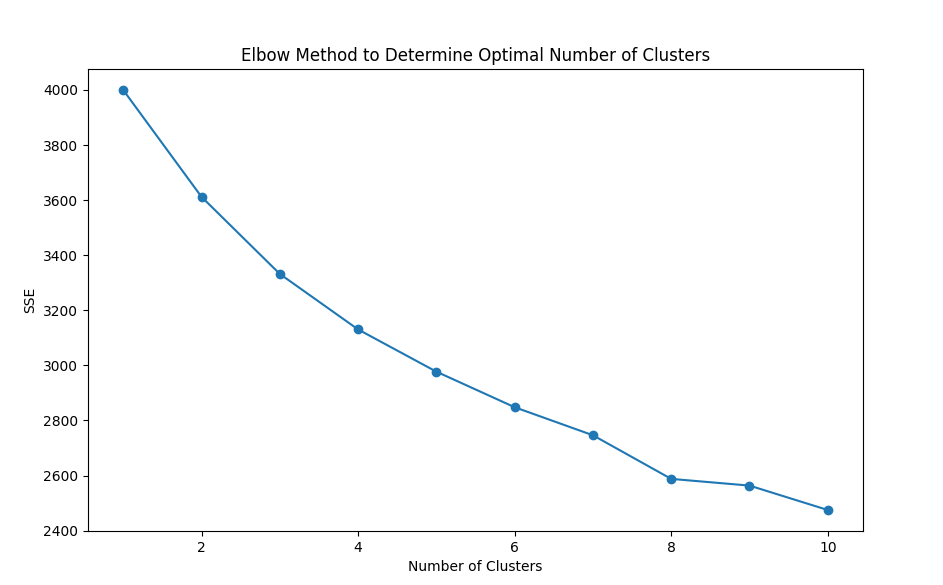
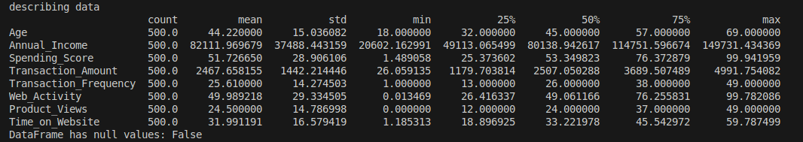
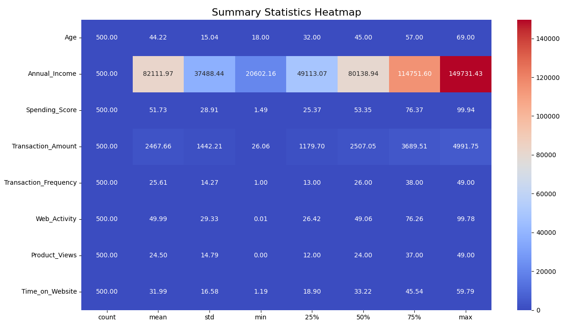
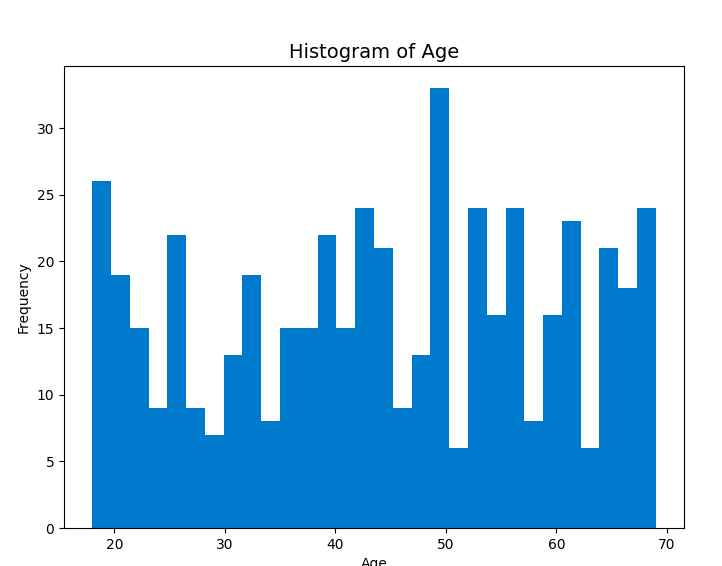
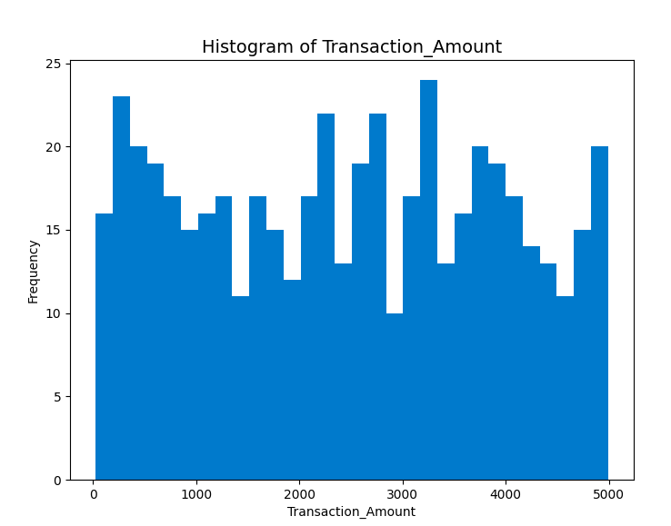
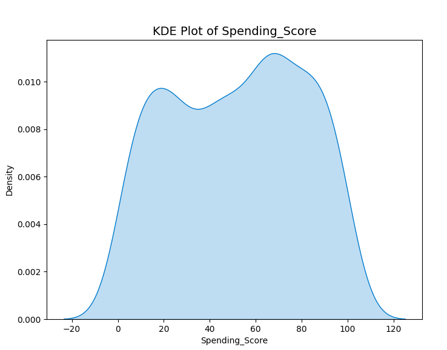
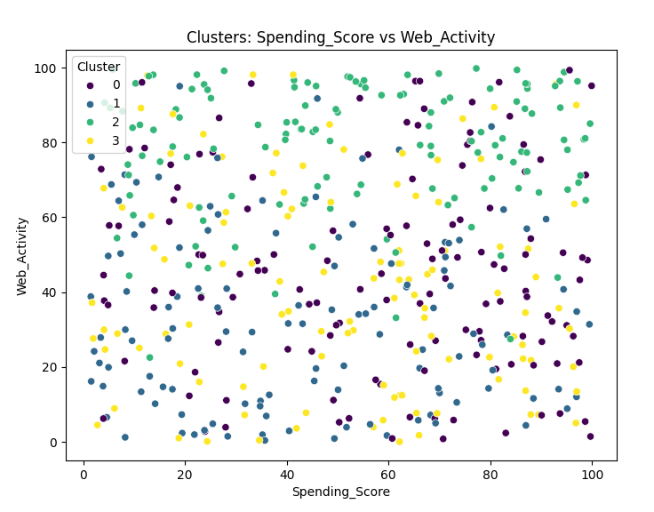
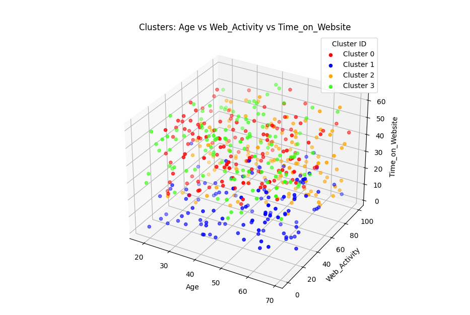

#  CUSTOMER SEGMENTATION USING KMEAN CLUSTERING 
- [CUSTOMER SEGMENTATION USING KMEAN CLUSTERING](#customer-segmentation-using-kmean-clustering)
  - [Overview:](#overview)
  - [Dataset:](#dataset)
  - [Steps:](#steps)
  - [Data anaysis and visualization:](#data-anaysis-and-visualization)
    - [Summary statistics of dataset:](#summary-statistics-of-dataset)
    - [statistical summary heatmap:](#statistical-summary-heatmap)
    - [histogram:](#histogram)
  - [Code:](#code)
  - [Dependencies:](#dependencies)
  - [visualization after clustering algorithm implementation:](#visualization-after-clustering-algorithm-implementation)
    - [Scatter plot (2D):](#scatter-plot-2d)
    - [Scatter plot (3D):](#scatter-plot-3d)

## Overview:
This project demonstrates the implementation of the K-Means clustering algorithm, a popular unsupervised machine learning technique used for partitioning a dataset into distinct clusters based on the similarity of data points. The goal of clustering is to group similar data points together while ensuring that the points in different groups (or clusters) are as distinct as possible.

## Dataset:
The dataset used in this project contains customer information with the following attributes:
- **Customer_ID:** Unique identifier for each customer.
- **Age:** Age of the customer.
- **Gender:** Gender of the customer (Male/Female).
- **Annual_Income:** Annual income of the customer 
- **Spending_Score:** Spending score of the customer.
-  **Transaction_Amount:** Total transaction amount for the customer.
- **Transaction_Frequency:** Number of transactions made by the customer.
- **Web_Activity**: Web activity score of the customer.
- **Product_Views**: Number of product views on the website by the customer.
- **Time_on_Website**: Time spent on the website by the customer in minutes.

## Steps:
1. **Data collection:**
   The data for customer segmentation was initially obtained from Kaggle. However, the original dataset had fewer features, limiting the depth of analysis. To enhance the dataset and improve the clustering process, additional features were generated using AI-based techniques

2. **Data Preprocessing**
   - Load the dataset and handle any missing values.
   - Encode categorical variables such as Gender.
   - Normalize numerical features for better clustering performance.
        ```
            def preprocess_data(data, features):
                #Standardize the selected features in the dataset.
                scaler = StandardScaler()
                data_scaled = scaler.fit_transform(data[features])
                return data_scaled

            #for encoding categorical values
            label_encoder = LabelEncoder()
            data['Gender'] = label_encoder.fit_transform(data['Gender'])
        ```
      
3. **Data selection:**
   - Select relevant features for clustering, such as Age, Annual_Income, Spending_Score, Transaction_Amount, Transaction_Frequency, Web_Activity, Product_Views, and Time_on_Website.
  
4. **K-Means Clustering:**
    - Build model using k-mean clustering algorithm from scratch
    - Determine the optimal number of clusters using methods such as the Elbow Method or Silhouette Score.
    - Apply K-means clustering to the dataset with the chosen number of clusters.
    - Analyze the resulting clusters to understand the characteristics of each customer segment.
  
    ### Implementation of elbow method for determining number of cluster:
    
    from this graph we can clearly see the optimal number of clusters are 8 but we have implemented out pipleline for diffrent numbers of clusters as well as for 8 by changing number of cluster for experimentation

5. **Results Analysis:**
   - Visualize the clusters using scatter plots or other appropriate visualizations.

6. **Implement labeled data after clustering in classifcation**
   - After clustering implement the labeled data in classifcation model for prediction
7. **User interface**
   - Use streamlit for user interface
   
## Data anaysis and visualization:
### Summary statistics of dataset:
Below given image shows tha statistical inforamtion of customer dataset

### statistical summary heatmap:

### histogram:
This image shows the data distribution with respect to age


Similarly for Trasaction amount is given below and to obtain histograms of allthe features run visualize_Data.py


Also,KDE plots are used for visualization:


## Code:
The code for this project is organized as follows:
- data
  - customer_data.csv
- model
  - model/kmeans_model.pkl
  - model/logistic_regression_model.pkl
- src
  - k_mean.py
  - classifcation.py
  - test.ipynb
- util_s
  - data_visualization.py
  - utils.py
- inference.py
- test.py
- visualize_Data.py
- output
- requirements.txt

**data:** Data folder contains data which is in .csv format and also contain preprocessed data

**model:** models folder contains the saved models for K-means clustering and a classification model. The classification model is trained to classify new data based on the clusters generated by the K-means algorithm

**src:** src folder contains scripts for implementing  k-mean clustering and classifcation model

**utils_s:** This folder contains some utility scripts or functions that are used throughout the projects like functions for visualization,and loading data as well as model
**output:** This folder contatins the data after added clustered labels

**inference.py:** This script contatins the implementation and testing of k-means clustering algorithm 

**test.py:** The test.py script implements and tests the classification model, which was trained on the data obtained after assigning cluster numbers. Additionally, this script incorporates Streamlit to provide a user-friendly interface for interacting with the model and visualizing the results.

**visualize_Data.py:** This script  contaitins functions to visualize data before and after implementation of k-mean clusters implementation

## Dependencies:
- *pandas*
- *numpy*
- *scikit-learn*
- *matplotlib*
-*seaborn*

These all requiered dependencies are added on requirements.txt file with its versions

command to install all the dependencies:
```
pip install -r requirements.txt
```
   
## visualization after clustering algorithm implementation:
### Scatter plot (2D):
Below image shows the clustered data implemented for 4 clusters

this image shows the 4 clusters represented with diffrent colors. For cluster visualization using other features run visualize_data.py. And to visualize for diffrent number of clusters change the number of clusters 

### Scatter plot (3D):
For better visualization 3D scatterplot is shown below:



References:

- [https://www.youtube.com/watch?v=7J3mz9LMjqg](https://www.youtube.com/watch?v=7J3mz9LMjqg)
- [https://www.geeksforgeeks.org/k-means-clustering-introduction/](https://www.geeksforgeeks.org/k-means-clustering-introduction/)
- [https://www.kaggle.com/datasets/shwetabh123/mall-customers](https://www.kaggle.com/datasets/shwetabh123/mall-customers)